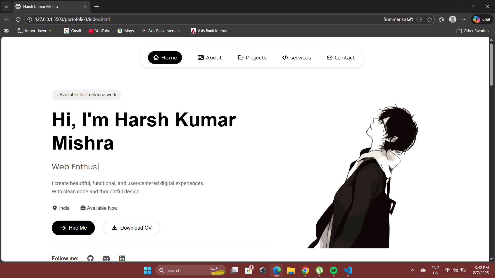

# 👨‍💻 Harsh Kumar Mishra - Personal Portfolio



> *Building Meaningful Digital Experiences with clean code and thoughtful design.*

## 📌 Overview
Welcome to my personal portfolio repository! This is a static website built from scratch using pure **HTML, CSS, and JavaScript**. It serves as a central hub to showcase my background, skills, and projects as a Computer Science student.

**View the Live Site:** https://harshportfilo.netlify.app/

---

## 🚀 Features
* **Pure HTML/CSS/JS:** Lightweight and fast performance without heavy frameworks.
* **Responsive Design:** Fully optimized for different screen sizes (Mobile/Desktop).
* **Interactive UI:** Smooth transitions and hover effects using CSS and Vanilla JS.
* **Contact Section:** Integrated layout for contact information.

---

## 🛠 Technologies Used

- **HTML5** – Structure and semantic content  
- **CSS3** – Styling, responsive layouts, Flexbox & Grid  
- **JavaScript (Vanilla JS)** – Interactivity and animations  
- **Font Awesome / Boxicons** – Icons  
- **AOS.js** – Scroll animations

---

## 📂 Featured Projects showcased in Portfolio

### 1. Career Advisor
An intelligent application utilizing machine learning to guide users toward suitable career paths based on their interests.
* [GitHub Repo](#) | [Live Demo](#)

### 2. Smart Campus Dashboard
A centralized dashboard designed for managing campus resources and monitoring smart devices in real-time.
* [GitHub Repo](#) | [Live Demo](#)

---

## 🎓 Education
**B.Tech in Computer Science and Engineering**
* *S.R. Institute of Management and Technology*
* Lucknow, India

---

## 📬 Get in Touch
I'm always open to discussing exciting projects and new opportunities.

* **Email:** harshbdh123@gmail.com
* **Phone:** +91 9565369151
* **Location:** Lucknow, India


---

## 💻 Installation (Run Locally)

Since this project uses only static files, you don't need to install any dependencies (like Node.js).

1.  **Clone the repository:**
    ```bash
    git clone [https://github.com/chessman2345788/portfoilo.git](https://github.com/chessman2345788/portfoilo.git)
    ```

2.  **Navigate to the project directory:**
    ```bash
    cd portfoilo
    ```

3.  **Run the site:**
    * Simply double-click `index.html` to open it in your browser.
    * **OR** if you use VS Code, right-click `index.html` and select **"Open with Live Server"**.

---

*© 2025 Harsh Kumar Mishra. All Rights Reserved.*
